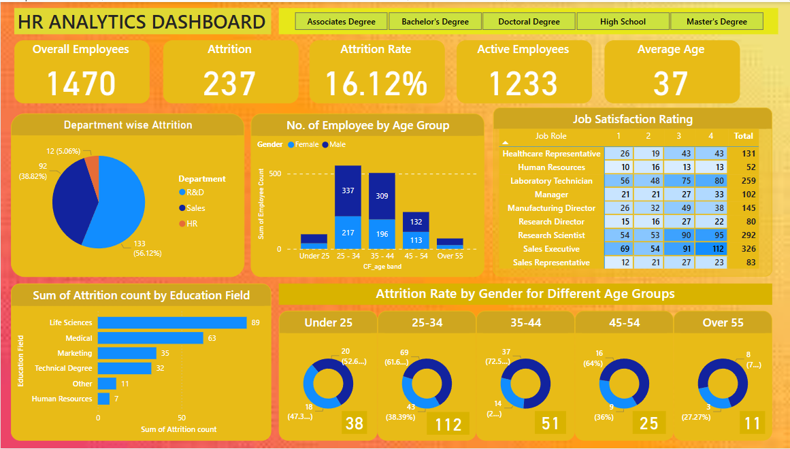

# 📊 HR Analytics Dashboard – Power BI Project

This project presents an interactive HR analytics dashboard built using Power BI, based on employee attrition and demographic data from Excel. It helps HR managers gain data-driven insights into employee attrition trends, job satisfaction, and demographic distribution.

---

## 📁 Dataset
- Source: Custom Excel sheet (included in repository)
- Fields: Employee age, gender, department, education, attrition status, job role, satisfaction rating, etc.

---

## 🎯 Key Insights & Features
- ✅ **Overall KPIs**: Attrition rate, total employees, active employees, average age
- 📈 **Department-wise Attrition**: Pie chart visual of attrition across R&D, Sales, and HR
- 📊 **Age Group Analysis**: Bar chart of employee distribution by age & gender
- 🎓 **Education Field Analysis**: Bar chart of attrition by education background
- 😊 **Job Satisfaction Ratings**: Matrix of satisfaction by job role
- 👥 **Attrition by Gender & Age**: Donut charts showing gender-wise attrition trends across age bands
- 🔍 **Slicers/Filters**: Interactive filters for education level and job roles

---

## 🧩 Tools & Techniques Used
- Power BI Desktop
- Excel for data preparation
- DAX for calculated columns/measures
- Custom visuals and slicers for interactivity

---

## 🖼️ Dashboard Preview

---

## 🚀 How to View
1. Download the `.pbix` file from this repository
2. Open it using [Power BI Desktop](https://powerbi.microsoft.com/en-us/downloads/)
3. Interact with filters, visuals, and data insights

---

## 📌 License
This project is intended for educational and portfolio purposes only.
